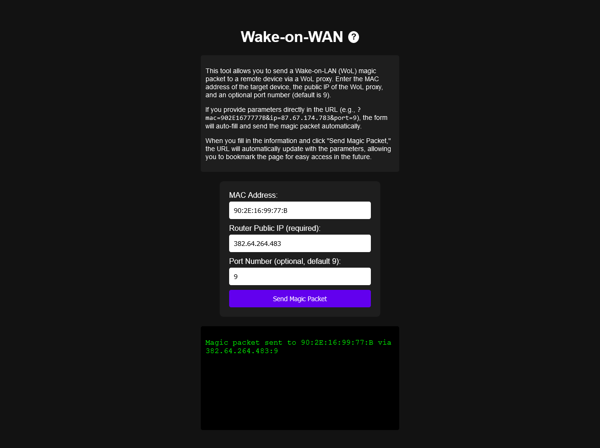

# WoLi WebGUI

WoLi WebGUI is an extremely lightweight (under 8MB) container image for sending WoL Magic Packets easily to a public WoL proxy of your choice.

I couldn't find anything like it for Wake on WAN, so I made my own with [blackjack and hookers](https://www.youtube.com/watch?v=e35AQK014tI).

## How to

See example [docker-compose.yml](doc/docker-compose.yml) and [Caddyfile](doc/Caddyfile). Yes, it's that simple. Nothing more than a standard modern browser is required on the client side, and it works on a mobile phone just as well as in a desktop browser.

You also need a working WoL proxy with a public IP, obviously, which is less simple (but I assume you already have one, otherwise why would you be here? I use the one integrated in the [Freebox router](https://portail.free.fr/) but there are [others](https://www.google.com/search?client=firefox-b-d&q=wol+proxy)).

## Usage

When you fill in the fields and click "Send Magic Packet", your target computer will wake and the URL will be modified to add your information. You can bookmark the page, and when you use that bookmark the packet will be sent as soon as the page loads.

You will get the output from the backend CGI scrip in the console space under the form.

## Uses

https://alpinelinux.org/

https://acme.com/software/mini_httpd/

https://en.wikipedia.org/wiki/Netcat